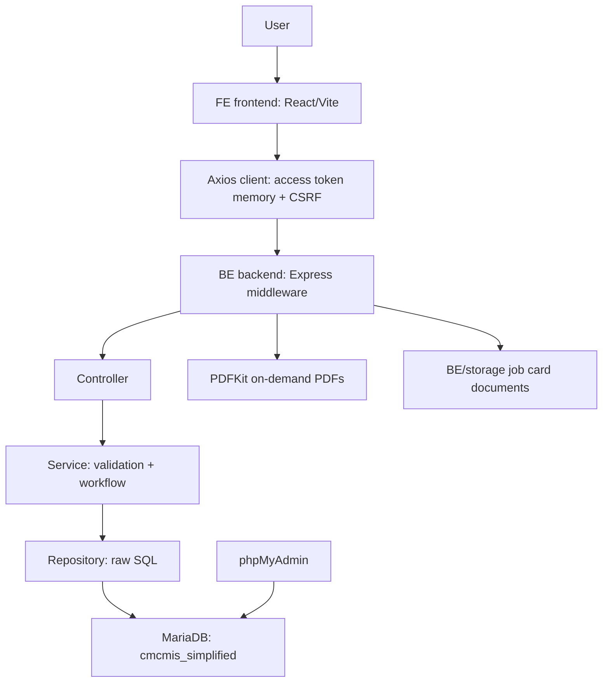
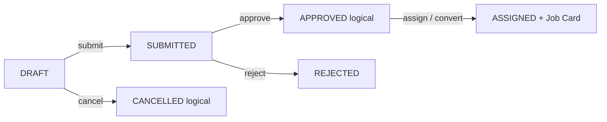
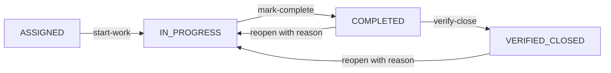

# CMCMIS End-to-End Codebase Deep Dive

Prepared on 2026-05-25 after inspecting FE, BE, DATABASE, TECH_DOCX, PDFs, temp, and the live MariaDB/phpMyAdmin-backed database.

## Color Legend

| Color | Meaning | Description |
|---|---|---|
| GREEN | Verified / healthy | Evidence confirms the behavior or connection is currently working. |
| BLUE | Core architecture | Stable design pattern or system structure to remember. |
| YELLOW | Attention / improvement | Not broken, but worth tracking before future expansion. |
| RED | Risk / blocker | Could break behavior or needs action before production confidence. |
| PURPLE | Memory / style | A rule, convention, or user preference I should preserve. |

## Executive Summary

| Status | Area | Insight |
|---|---|---|
| GREEN | Database | MariaDB/phpMyAdmin and BE DB pool are connected to `cmcmis_simplified`. |
| GREEN | Frontend | `npm run build` succeeded; Vite transformed 2546 modules. |
| GREEN | Backend | DB pool boot check succeeded with poolLimit 15. |
| BLUE | Architecture | React/Vite frontend -> Express backend -> service/repository -> MariaDB. |
| YELLOW | Maintainability | Frontend bundle is large and should later be split. |
| YELLOW | Gaps | Some reserved/stub routes and stale verifier expectations remain. |

## Project Architecture

## Folder Inventory

| Folder | Files | Role |
|---|---:|---|
| BE | 151 | Backend API, modules, middleware, PDF generators, DB config. |
| FE | 159 | React pages, hooks, API clients, layout, permissions. |
| DATABASE | 53 | Migrations, runner, SQL/schema documentation. |
| PDFs | 35 | Historical/reference PDF and SQL artifacts. |
| TECH_DOCX | 21 before this report | Generated technical documentation. |
| temp | 39 | Temporary discovery/schema/export artifacts. |

## Frontend Route Memory

| Route | Feature | Permission |
|---|---|---|
| `/dashboard` | Dashboard | `dashboard:view` |
| `/equipment` | Equipment list | `equipment:read-list` |
| `/equipment/new` | New equipment | `equipment:create` |
| `/job-requests` | Job Request list | `job_request:read-own` |
| `/job-requests/new` | New Job Request | `job_request:create` |
| `/conversion` | Conversion | `job_request:approve` |
| `/job-cards` | Job Card list | `job_card:read-list` |
| `/job-cards/:id` | Job Card detail | `job_card:read-detail` |
| `/schedule` | Schedule | `schedule:read-list` |
| `/procurement` | Procurement | `procurement:read-list` |
| `/inquiry` | Inquiry | `inquiry search permissions` |
| `/reports` | Reports | `reports:view-analytics` |
| `/analytics` | Analytics | `analytics:view` |
| `/admin/users` | Admin users | `user:read-list` |
| `/admin/employees` | Admin employees | `master:employees:manage` |
| `/audit` | Audit | `audit:read-list` |

## Backend Module Inventory

| Module | Files | Lines | Responsibility |
|---|---:|---:|---|
| adminUsers | 6 | 1054 | User administration. |
| analytics | 5 | 720 | Charts and CSV exports. |
| audit | 5 | 891 | Audit exploration. |
| auth | 7 | 841 | Login/refresh/logout. |
| dashboard | 5 | 991 | KPI aggregation. |
| employees | 5 | 762 | Employee master. |
| equipment | 5 | 836 | Equipment list/create/helpers. |
| inquiry | 5 | 721 | Search. |
| jobCards | 22 | 3122 | Largest workflow module. |
| jobRequests | 6 | 2545 | Request lifecycle. |
| pdf | 9 | 1969 | PDF generation. |
| reports | 6 | 1961 | Reports/PDF export. |
| schedule | 7 | 1240 | Schedule/ICS. |
| procurement | 5 | 1210 | Purchase/spares. |

## Job Request Flow

## Job Card Flow

## Live Database Snapshot

| Item | Value |
|---|---:|
| Tables | 104 |
| Roles | 5 |
| Permissions | 73 |
| Users | 61 |
| Equipment records | 5701 |
| Job requests | 21520 |
| Job cards | 19440 |
| Job request history rows | 21614 |
| Audit log rows | 138 |
| Schema migration rows | 38 |

## Risks and Attention Map

| Color | Attention item | Action |
|---|---|---|
| YELLOW | Large FE bundle | Add route-level lazy loading/manual chunks later. |
| YELLOW | Equipment stubs | Finish detail/update/verify/condemn/delete or hide UI entry points. |
| YELLOW | Legacy job-card PDF stub | Consolidate around current `.pdf` endpoints. |
| YELLOW | Token capsule route patterns | Compare pattern map against current BE routes. |
| YELLOW | DATABASE env mismatch | Document or align `final` vs `cmcmis_simplified`. |
| GREEN | No red blocker found | Build/connectivity checks are green. |

## Long-Term Memory

- FE means frontend folder.
- BE means backend folder.
- DATABASE means database folder.
- User style is color-coded, table-based, flowchart/diagram heavy, beginner-to-advanced.
- Code style is JavaScript-first.
- RBAC should use permission codes, not role-name checks.
- Job Request and Job Card state machines are the heart of the project.
- Always verify live DB schema before assuming table shape.